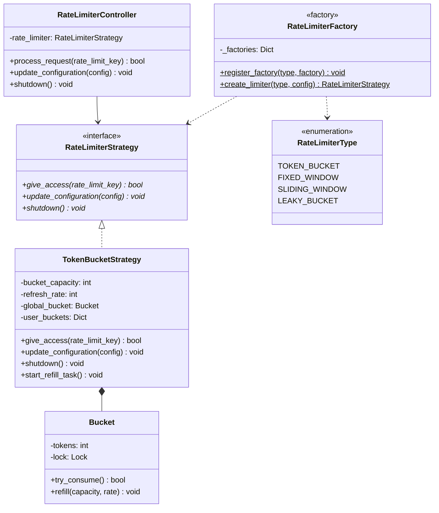
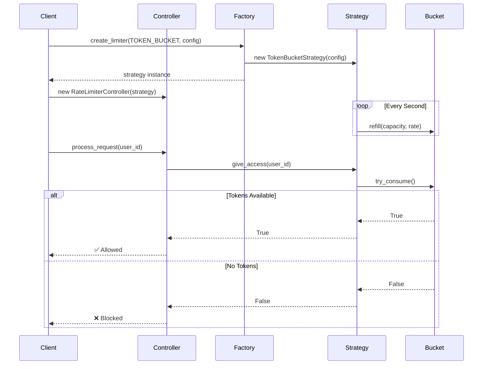
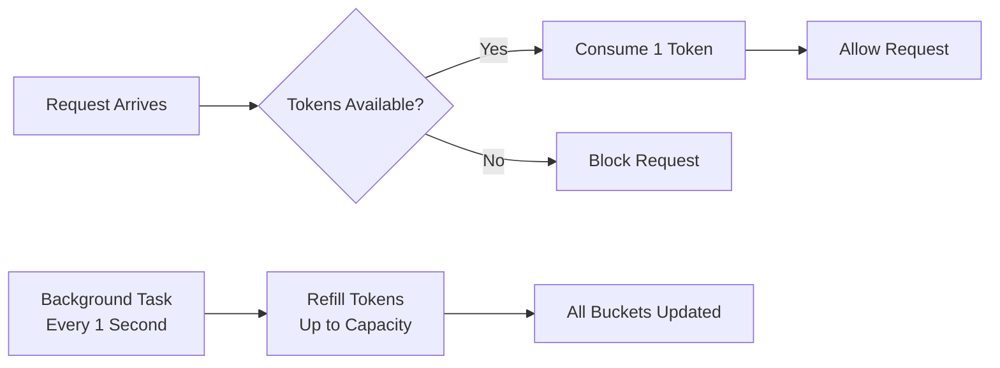
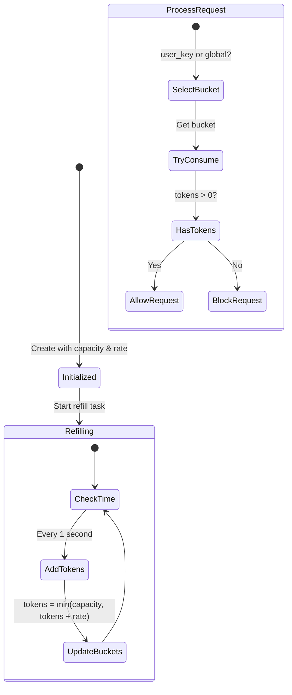

# Rate Limiter - Python LLD Implementation

A rate limiting implementation demonstrating advanced software design patterns in Python with support for both threading and async operations.

## Features

- **Extensible Architecture**: Strategy Pattern, Factory Pattern, and Controller design
- **Token Bucket Algorithm**: Fully implemented with burst support and token refill
- **Thread-Safe**: Full threading support with `threading.Lock` and `ThreadPoolExecutor`
- **Async Support**: Native async/await with `asyncio.Lock` and `asyncio.gather`
- **Per-User & Global Limiting**: Support for both user-specific and global rate limits
- **Dynamic Configuration**: Runtime configuration updates
- **Zero Dependencies**: Pure Python implementation

## Installation & Setup

```bash
# Clone or navigate to the rate-limiter directory
cd rate-limiter

# No external dependencies required!
# Python 3.10+ required for async support

# Run the threading version
python3 token_bucket_threading.py

# Run the async version
python3 token_bucket_async.py
```

**Note:** This is a pure Python implementation with zero external dependencies!

## Architecture

This implementation demonstrates advanced software design patterns for building extensible systems:



### Design Patterns Used

1. **Strategy Pattern**: `RateLimiterStrategy` defines the interface; different algorithms implement it
2. **Factory Pattern**: `RateLimiterFactory` creates appropriate rate limiter instances
3. **Inner Class Pattern**: `Bucket` encapsulates token bucket logic with thread-safety
4. **Controller Pattern**: `RateLimiterController` orchestrates request processing

### Component Flow



## Quick Start

### Threading Version (token_bucket_threading.py)

```python
from token_bucket_threading import (
    RateLimiterController,
    RateLimiterType,
    TokenBucketStrategy
)
import time

# Create controller with factory pattern
config = {"capacity": 5, "refresh_rate": 1}  # 5 tokens max, 1 token/second
controller = RateLimiterController(RateLimiterType.TOKEN_BUCKET, config)

# Global rate limiting
if controller.process_request():
    print("Request allowed!")
else:
    print("Rate limited!")

# Per-user rate limiting
controller.process_request(rate_limit_key="user123")
controller.process_request(rate_limit_key="user456")

# Concurrent burst handling with ThreadPoolExecutor
futures = [controller.executor.submit(controller.process_request) for _ in range(10)]
results = [f.result() for f in futures]
print(f"Allowed: {sum(results)} out of 10")

# Clean shutdown
controller.shutdown()
```

### Async Version (token_bucket_async.py)

```python
from token_bucket_async import (
    RateLimiterController,
    RateLimiterType
)
import asyncio

async def main():
    # Create async controller
    config = {"capacity": 5, "refresh_rate": 1}
    controller = RateLimiterController(RateLimiterType.TOKEN_BUCKET, config)
    
    # Global rate limiting
    if await controller.process_request():
        print("Request allowed!")
    
    # Per-user rate limiting
    await controller.process_request(rate_limit_key="user123")
    
    # Concurrent burst handling
    tasks = [controller.process_request() for _ in range(10)]
    results = await asyncio.gather(*tasks)
    print(f"Allowed: {sum(results)} out of 10")
    
    # Clean shutdown
    await controller.shutdown()

asyncio.run(main())
```

## Token Bucket Algorithm

The **Token Bucket** algorithm is implemented with both threading and async support. It allows burst traffic while maintaining an average rate by using tokens as a metaphor for request capacity.

### How It Works



### Algorithm Flow



### Key Characteristics

**Advantages:**
- ✅ Allows bursts up to capacity (e.g., 5 requests instantly if bucket is full)
- ✅ Smooth refilling over time (1 token/second = sustainable rate)
- ✅ Simple and efficient (O(1) per request)
- ✅ Supports both global and per-user limits
- ✅ Thread-safe with fine-grained locking

**Trade-offs:**
- ⚠️ Can allow large bursts after idle periods
- ⚠️ Memory grows with number of unique users (per-user buckets)

### Configuration Parameters

```python
config = {
    "capacity": 10,      # Maximum tokens in bucket (burst size)
    "refresh_rate": 5    # Tokens added per second (sustained rate)
}
```

**Example Behavior:**
- Capacity = 10, Rate = 1/sec
  - At t=0: 10 requests allowed instantly (burst)
  - At t=1: 11 requests total (10 initial + 1 refilled)
  - At t=10: 20 requests total (10 initial + 10 refilled)
  
- Capacity = 5, Rate = 5/sec
  - Sustained throughput: 5 requests/second
  - Burst allowance: 5 requests instantly if idle

### Thread Safety Implementation

Both versions use lock-based concurrency control:

**Threading Version:**
```python
class Bucket:
    def try_consume(self) -> bool:
        with self.lock:  # threading.Lock()
            if self.tokens > 0:
                self.tokens -= 1
                return True
            return False
```

**Async Version:**
```python
class Bucket:
    async def try_consume(self) -> bool:
        async with self.lock:  # asyncio.Lock()
            if self.tokens > 0:
                self.tokens -= 1
                return True
            return False
```

## Implementation Details

### Core Components

#### 1. RateLimiterStrategy (Abstract Interface)

```python
class RateLimiterStrategy(ABC):
    """Interface for all rate limiting strategies."""
    
    @abstractmethod
    def give_access(self, rate_limit_key: Optional[str]) -> bool:
        """Check if request should be allowed."""
        pass
    
    @abstractmethod
    def update_configuration(self, config: Dict[str, Any]) -> None:
        """Update configuration dynamically."""
        pass
    
    @abstractmethod
    def shutdown(self) -> None:
        """Clean up resources."""
        pass
```

**Benefits:**
- Extensible: Add new algorithms by implementing this interface
- Testable: Mock implementations for unit testing
- Maintainable: Changes to one algorithm don't affect others

#### 2. TokenBucketStrategy (Concrete Implementation)

Implements the Token Bucket algorithm with:
- **Global Bucket**: Single bucket for all requests (default)
- **Per-User Buckets**: Separate bucket per `rate_limit_key`
- **Background Refill**: Automatic token replenishment

**Key Methods:**
- `give_access(rate_limit_key)`: Check and consume token
- `start_refill_task()`: Begin periodic refill (threading/async)
- `update_configuration(config)`: Change rate dynamically
- `shutdown()`: Stop refill and cleanup

#### 3. RateLimiterFactory (Factory Pattern)

```python
class RateLimiterFactory:
    _factories: Dict[RateLimiterType, Callable] = {}
    
    @classmethod
    def register_factory(cls, limiter_type, factory):
        cls._factories[limiter_type] = factory
    
    @classmethod
    def create_limiter(cls, limiter_type, config):
        return cls._factories[limiter_type](config)
```

**Benefits:**
- Decouples creation from usage
- Easy to add new rate limiter types
- Centralized configuration

#### 4. RateLimiterController (Controller Pattern)

Orchestrates request processing:
- **Threading Version**: Uses `ThreadPoolExecutor` for concurrent requests
- **Async Version**: Uses `asyncio.gather` for concurrent requests

```python
controller = RateLimiterController(RateLimiterType.TOKEN_BUCKET, config)
allowed = controller.process_request(rate_limit_key="user123")
```

### Extensibility: Adding New Algorithms

The current implementation defines placeholders for additional algorithms:

```python
class RateLimiterType(Enum):
    TOKEN_BUCKET = "token_bucket"
    FIXED_WINDOW = "fixed_window"       # Future: Fixed time window
    SLIDING_WINDOW = "sliding_window"   # Future: Rolling time window
    LEAKY_BUCKET = "leaky_bucket"       # Future: Constant output rate
```

To add a new algorithm:

**1. Implement the Strategy Interface:**
```python
class SlidingWindowStrategy(RateLimiterStrategy):
    def __init__(self, max_requests: int, window_size: int):
        self.max_requests = max_requests
        self.window_size = window_size
        self.requests = []
        self.lock = threading.Lock()
    
    def give_access(self, rate_limit_key: Optional[str]) -> bool:
        with self.lock:
            now = time.time()
            # Remove expired requests
            self.requests = [r for r in self.requests if now - r < self.window_size]
            
            if len(self.requests) < self.max_requests:
                self.requests.append(now)
                return True
            return False
    
    def update_configuration(self, config: Dict[str, Any]) -> None:
        if "max_requests" in config:
            self.max_requests = config["max_requests"]
    
    def shutdown(self) -> None:
        self.requests.clear()
```

**2. Register the Factory:**
```python
def _create_sliding_window(config: Dict[str, Any]) -> SlidingWindowStrategy:
    max_requests = config.get("max_requests", 100)
    window_size = config.get("window_size", 60)
    return SlidingWindowStrategy(max_requests, window_size)

RateLimiterFactory.register_factory(
    RateLimiterType.SLIDING_WINDOW, 
    _create_sliding_window
)
```

**3. Use the New Algorithm:**
```python
config = {"max_requests": 100, "window_size": 60}
controller = RateLimiterController(RateLimiterType.SLIDING_WINDOW, config)
```

### Per-User vs Global Rate Limiting

The implementation supports both patterns:

**Global Rate Limiting:**
```python
# All requests share one bucket
controller.process_request()  # No rate_limit_key
```

**Per-User Rate Limiting:**
```python
# Each user gets their own bucket
controller.process_request(rate_limit_key="user123")
controller.process_request(rate_limit_key="user456")
```

**Use Cases:**
- **Global**: Protect backend service from total overload (e.g., database connections)
- **Per-User**: Fair usage enforcement (e.g., API quotas per customer)

### Concurrency Models Comparison

| Aspect          | Threading Version                  | Async Version                                  |
| --------------- | ---------------------------------- | ---------------------------------------------- |
| **Lock Type**   | `threading.Lock`                   | `asyncio.Lock`                                 |
| **Execution**   | `ThreadPoolExecutor`               | `asyncio.gather`                               |
| **Refill Task** | Background thread                  | `asyncio.create_task`                          |
| **Best For**    | CPU-bound operations, blocking I/O | I/O-bound operations, many concurrent requests |
| **Shutdown**    | `thread.join()`                    | `task.cancel()` + `await`                      |

### Dynamic Configuration

Update rate limits at runtime:

```python
# Initial configuration
controller = RateLimiterController(
    RateLimiterType.TOKEN_BUCKET,
    {"capacity": 10, "refresh_rate": 1}
)

# Later: increase rate limit (threading version)
controller.update_configuration({"refresh_rate": 5})

# Or: async version
await controller.update_configuration({"refresh_rate": 5})
```

**Note:** Configuration updates affect refill rate but don't reset existing tokens.

## Demo Output

### Example 1: Global Rate Limiting (Burst)
```
=== EXAMPLE 1: Global rate limiting - Burst ===
Request [global]: ✅ Allowed
Request [global]: ✅ Allowed
Request [global]: ✅ Allowed
Request [global]: ✅ Allowed
Request [global]: ✅ Allowed
Request [global]: ❌ Blocked
Request [global]: ❌ Blocked
Request [global]: ❌ Blocked
Request [global]: ❌ Blocked
Request [global]: ❌ Blocked
Results: 5 allowed, 5 blocked (total: 10)
```
*Shows burst allowance: 5 tokens consumed instantly, remaining blocked.*

### Example 2: After Refill
```
=== EXAMPLE 2: After 3 seconds refill ===
Waiting 3 seconds...
Request [global]: ✅ Allowed
Request [global]: ✅ Allowed
Request [global]: ✅ Allowed
Request [global]: ❌ Blocked
Request [global]: ❌ Blocked
Results: 3 allowed, 7 blocked (total: 10)
```
*After 3 seconds: 3 tokens refilled (1 token/sec), allowing 3 more requests.*

### Example 3: Per-User Rate Limiting
```
=== EXAMPLE 3: Per-user rate limiting ===
Requests for user1:
Request [user1]: ✅ Allowed (x5)
Request [user1]: ❌ Blocked (x2)
Results: 5 allowed, 2 blocked (total: 7)

Requests for user2:
Request [user2]: ✅ Allowed (x5)
Request [user2]: ❌ Blocked (x2)
Results: 5 allowed, 2 blocked (total: 7)
```
*Each user has their own bucket with 5 tokens.*

## API Reference

### RateLimiterController

Main interface for using the rate limiter.

**Constructor:**
```python
RateLimiterController(limiter_type: RateLimiterType, config: Dict[str, Any])
```

**Methods:**
- `process_request(rate_limit_key: Optional[str] = None) -> bool`
  - Process a request with rate limiting
  - Returns `True` if allowed, `False` if blocked
  
- `update_configuration(config: Dict[str, Any]) -> None`
  - Update rate limiter configuration at runtime
  
- `shutdown() -> None`
  - Clean shutdown of rate limiter resources

### TokenBucketStrategy

Token Bucket algorithm implementation.

**Configuration:**
```python
{
    "capacity": int,       # Maximum tokens (burst size)
    "refresh_rate": int    # Tokens added per second
}
```

**Methods:**
- `give_access(rate_limit_key: Optional[str]) -> bool`
  - Check and consume token if available
  
- `start_refill_task() -> None`
  - Start background refill thread/task
  
- `update_configuration(config: Dict[str, Any]) -> None`
  - Update refresh rate dynamically
  
- `shutdown() -> None`
  - Stop refill task

### RateLimiterType (Enum)

Available rate limiter types:
- `TOKEN_BUCKET`: Currently implemented
- `FIXED_WINDOW`: Reserved for future
- `SLIDING_WINDOW`: Reserved for future
- `LEAKY_BUCKET`: Reserved for future

## Project Structure

```
rate-limiter/
├── token_bucket_threading.py    # Threading implementation
├── token_bucket_async.py        # Async/await implementation
├── pyproject.toml               # Project metadata
└── README.md                    # This file
```

**Key Files:**
- `token_bucket_threading.py`: Complete threading-based implementation with `ThreadPoolExecutor`
- `token_bucket_async.py`: Complete async-based implementation with `asyncio`

## Performance Characteristics

### Time Complexity
- **Token Consumption**: O(1)
- **Token Refill**: O(n) where n = number of active buckets
- **Bucket Lookup**: O(1) with dictionary

### Space Complexity
- **Global Bucket**: O(1)
- **Per-User Buckets**: O(u) where u = number of unique users

### Concurrency
- **Lock Granularity**: Per-bucket locks (minimal contention)
- **Critical Section**: Only token consumption/refill operations
- **Thread-Safe**: All operations protected by locks

## Common Use Cases

### API Gateway Rate Limiting
```python
# Protect backend with 1000 requests/minute burst, 100/sec sustained
config = {"capacity": 1000, "refresh_rate": 100}
gateway_limiter = RateLimiterController(RateLimiterType.TOKEN_BUCKET, config)

@app.route('/api/*')
def handle_request():
    if not gateway_limiter.process_request():
        return {"error": "Rate limit exceeded"}, 429
    return process_api_request()
```

### Per-User API Quotas
```python
# Each user gets 10 requests/second
config = {"capacity": 10, "refresh_rate": 10}
user_limiter = RateLimiterController(RateLimiterType.TOKEN_BUCKET, config)

@app.route('/api/user/<user_id>/*')
def handle_user_request(user_id):
    if not user_limiter.process_request(rate_limit_key=user_id):
        return {"error": "User rate limit exceeded"}, 429
    return process_user_request(user_id)
```

### Database Connection Limiting
```python
# Limit concurrent database queries to 50/second
config = {"capacity": 50, "refresh_rate": 50}
db_limiter = RateLimiterController(RateLimiterType.TOKEN_BUCKET, config)

async def query_database(sql, user_id):
    if not await db_limiter.process_request(rate_limit_key=user_id):
        raise Exception("Database query rate limit exceeded")
    return await db.execute(sql)
```

## Design Principles Demonstrated

### SOLID Principles

1. **Single Responsibility Principle**
   - `Bucket`: Manages token state
   - `TokenBucketStrategy`: Implements algorithm logic
   - `RateLimiterController`: Handles request processing
   - `RateLimiterFactory`: Creates instances

2. **Open/Closed Principle**
   - Open for extension: Add new algorithms via `RateLimiterStrategy`
   - Closed for modification: Existing code unchanged when adding algorithms

3. **Liskov Substitution Principle**
   - Any `RateLimiterStrategy` implementation can replace another
   - Controller works with any strategy

4. **Interface Segregation Principle**
   - `RateLimiterStrategy` has minimal required methods
   - Clients only depend on what they use

5. **Dependency Inversion Principle**
   - Controller depends on `RateLimiterStrategy` abstraction
   - Not tied to concrete implementations

### Design Patterns

1. **Strategy Pattern**: Swap algorithms at runtime
2. **Factory Pattern**: Centralized object creation
3. **Inner Class Pattern**: Encapsulation with `Bucket`
4. **Controller Pattern**: Orchestrate request flow

## Best Practices

### Configuration Guidelines

1. **Capacity (Burst Size)**
   - Set based on peak expected traffic
   - Too low: Legitimate bursts blocked
   - Too high: Ineffective rate limiting

2. **Refresh Rate (Sustained Rate)**
   - Set based on backend capacity
   - Match your service's throughput limits
   - Consider downstream dependencies

### Operational Considerations

1. **Monitoring**
   - Track allowed vs blocked requests
   - Monitor per-user metrics
   - Alert on unusual blocking patterns

2. **Graceful Degradation**
   - Return appropriate HTTP 429 status
   - Include `Retry-After` header
   - Log rate limit events

3. **Testing**
   - Test burst scenarios
   - Verify refill timing
   - Check concurrent access
   - Test user isolation

## Future Enhancements

Potential additions to the implementation:

1. **Additional Algorithms**
   - Fixed Window Counter
   - Sliding Window Log
   - Leaky Bucket

2. **Distributed Rate Limiting**
   - Redis backend for shared state
   - Consistent hashing for sharding
   - Clock synchronization

3. **Advanced Features**
   - Rate limit exemptions (whitelisting)
   - Dynamic rate adjustment based on load
   - Cost-based limiting (different weights per operation)
   - Rate limit hierarchies (user, organization, global)

4. **Observability**
   - Prometheus metrics export
   - Detailed logging
   - Rate limit analytics dashboard

## Contributing

This is a learning implementation demonstrating Low-Level Design principles. Key areas for extension:

- Implement additional algorithms (Sliding Window, Leaky Bucket)
- Add comprehensive unit tests
- Add distributed rate limiting with Redis
- Performance benchmarking
- Documentation improvements

## License

MIT License - see LICENSE file for details

## Author

Created as a comprehensive Low-Level Design (LLD) implementation demonstrating:
- Advanced design patterns (Strategy, Factory, Controller)
- SOLID principles in practice
- Thread-safe concurrent programming
- Async/await patterns in Python
- Extensible architecture for real-world systems
