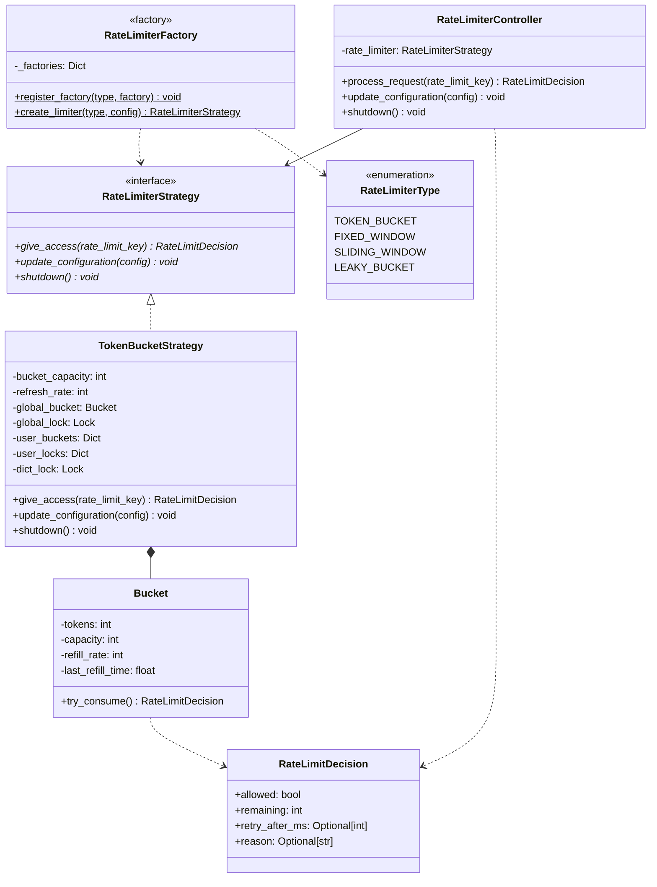
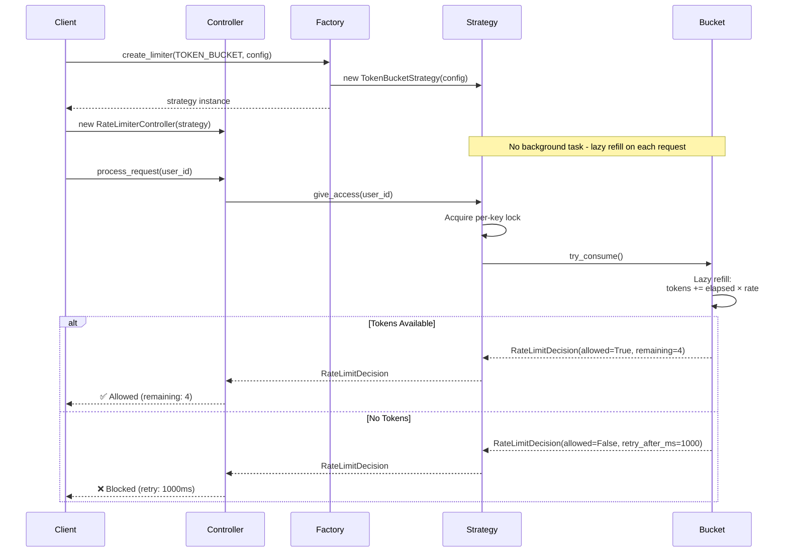
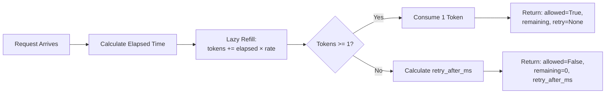
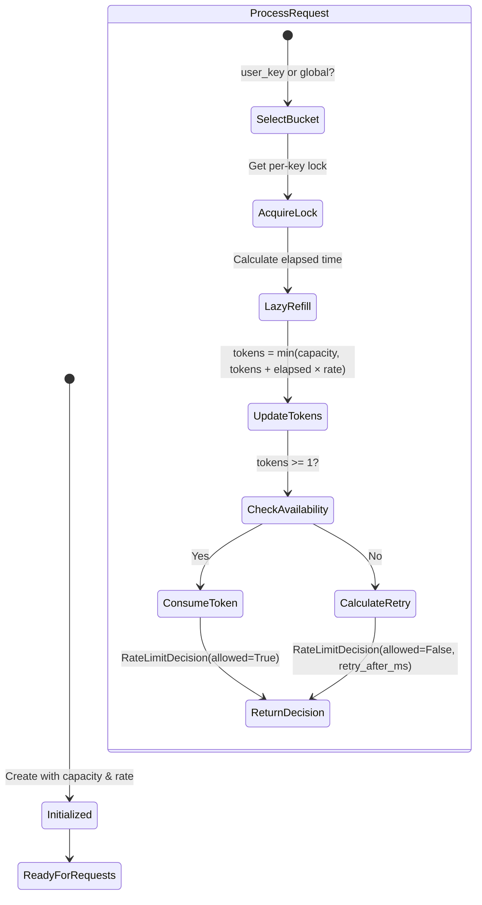

# Rate Limiter - Python LLD Implementation

A production-ready rate limiting implementation demonstrating advanced software design patterns in Python with support for both threading and async operations.

## Features

- **Extensible Architecture**: Strategy Pattern, Factory Pattern, and Controller design
- **Token Bucket Algorithm**: Lazy refill implementation using monotonic time
- **Rich Metadata**: Returns `RateLimitDecision` with remaining tokens, retry timing, and reasons
- **Per-Key Locking**: Fine-grained concurrency control for optimal throughput
- **Thread-Safe**: Full threading support with `threading.Lock` and per-key locks
- **Async Support**: Native async/await with `asyncio.Lock` and per-key async locks
- **Per-User & Global Limiting**: Support for both user-specific and global rate limits
- **Dynamic Configuration**: Runtime configuration updates
- **Zero Dependencies**: Pure Python implementation

## Installation & Setup

```bash
# Clone or navigate to the rate-limiter directory
cd rate-limiter

# No external dependencies required!
# Python 3.10+ required for async support

# Run the threading version
python3 token_bucket_threading.py

# Run the async version
python3 token_bucket_async.py
```

**Note:** This is a pure Python implementation with zero external dependencies!

## Design Highlights

### Recent Improvements

This implementation incorporates several production-ready enhancements:

1. **Lazy Refill Architecture** 🚀
   - Eliminated background threads/tasks
   - Tokens calculated on-demand using `time.monotonic()`
   - More accurate and resource-efficient

2. **Rich Return Type** 📊
   - Returns `RateLimitDecision` dataclass instead of boolean
   - Includes: `allowed`, `remaining` tokens, `retry_after_ms`, `reason`
   - Enables proper HTTP 429 responses and client-side backoff

3. **Per-Key Locking** 🔐
   - Fine-grained locks per user/key instead of global dictionary lock
   - Dramatically improves concurrent throughput
   - Separate `dict_lock` for dictionary structure modifications

4. **Production Awareness** 🏭
   - Comprehensive documentation of limitations (memory leaks, distributed state)
   - Redis-based distributed solution examples
   - Interview-ready trade-off discussions

## Architecture

This implementation demonstrates advanced software design patterns for building extensible systems:



### Design Patterns Used

1. **Strategy Pattern**: `RateLimiterStrategy` defines the interface; different algorithms implement it
2. **Factory Pattern**: `RateLimiterFactory` creates appropriate rate limiter instances
3. **Inner Class Pattern**: `Bucket` encapsulates token bucket logic with thread-safety
4. **Controller Pattern**: `RateLimiterController` orchestrates request processing

### Component Flow



## Quick Start

### Threading Version (token_bucket_threading.py)

```python
from token_bucket_threading import (
    RateLimiterController,
    RateLimiterType,
    RateLimitDecision
)
import time

# Create controller with factory pattern
config = {"capacity": 5, "refresh_rate": 1}  # 5 tokens max, 1 token/second
controller = RateLimiterController(RateLimiterType.TOKEN_BUCKET, config)

# Global rate limiting
decision = controller.process_request()
if decision.allowed:
    print(f"✅ Request allowed! Remaining: {decision.remaining} tokens")
else:
    print(f"❌ Blocked! Retry after {decision.retry_after_ms}ms")

# Per-user rate limiting
decision = controller.process_request(rate_limit_key="user123")
print(f"User123 - Allowed: {decision.allowed}, Remaining: {decision.remaining}")

# Concurrent burst handling with ThreadPoolExecutor
futures = [controller.executor.submit(controller.process_request) for _ in range(10)]
results = [f.result() for f in futures]
allowed_count = sum(1 for r in results if r.allowed)
print(f"Allowed: {allowed_count} out of 10")

# Clean shutdown
controller.shutdown()
```

### Async Version (token_bucket_async.py)

```python
from token_bucket_async import (
    RateLimiterController,
    RateLimiterType,
    RateLimitDecision
)
import asyncio

async def main():
    # Create async controller
    config = {"capacity": 5, "refresh_rate": 1}
    controller = RateLimiterController(RateLimiterType.TOKEN_BUCKET, config)
    
    # Global rate limiting
    decision = await controller.process_request()
    if decision.allowed:
        print(f"✅ Allowed! Remaining: {decision.remaining}")
    else:
        print(f"❌ Blocked! Retry: {decision.retry_after_ms}ms")
    
    # Per-user rate limiting
    decision = await controller.process_request(rate_limit_key="user123")
    
    # Concurrent burst handling
    tasks = [controller.process_request() for _ in range(10)]
    results = await asyncio.gather(*tasks)
    allowed_count = sum(1 for r in results if r.allowed)
    print(f"Allowed: {allowed_count} out of 10")
    
    # Clean shutdown
    await controller.shutdown()

asyncio.run(main())
```

## Token Bucket Algorithm

The **Token Bucket** algorithm is implemented with both threading and async support using **lazy refill** strategy. It allows burst traffic while maintaining an average rate by using tokens as a metaphor for request capacity.

### How It Works



### Algorithm Flow



### Key Characteristics

**Lazy Refill Design:**
- ✅ No background threads/tasks needed
- ✅ Tokens calculated on-demand using `time.monotonic()`
- ✅ Eliminates race conditions between refill and consumption
- ✅ More accurate token accounting
- ✅ Lower resource overhead

**Advantages:**
- ✅ Allows bursts up to capacity (e.g., 5 requests instantly if bucket is full)
- ✅ Smooth refilling over time (1 token/second = sustainable rate)
- ✅ Simple and efficient (O(1) per request)
- ✅ Supports both global and per-user limits
- ✅ Thread-safe with fine-grained per-key locking
- ✅ Rich metadata for callers (`RateLimitDecision`)

**Trade-offs:**
- ⚠️ Can allow large bursts after idle periods
- ⚠️ Memory grows with number of unique users (per-user buckets)
- ⚠️ Process-local only (not distributed by default)

### Configuration Parameters

```python
config = {
    "capacity": 10,      # Maximum tokens in bucket (burst size)
    "refresh_rate": 5    # Tokens added per second (sustained rate)
}
```

**Example Behavior:**
- Capacity = 10, Rate = 1/sec
  - At t=0: 10 requests allowed instantly (burst)
  - At t=1: 11 requests total (10 initial + 1 refilled)
  - At t=10: 20 requests total (10 initial + 10 refilled)
  
- Capacity = 5, Rate = 5/sec
  - Sustained throughput: 5 requests/second
  - Burst allowance: 5 requests instantly if idle

### Thread Safety Implementation

Both versions use per-key locking with lazy refill:

**Threading Version:**
```python
class Bucket:
    def try_consume(self) -> RateLimitDecision:
        # Caller must hold per-key lock
        # Lazy refill: calculate tokens based on elapsed time
        now = time.monotonic()
        elapsed = now - self.last_refill_time
        tokens_to_add = elapsed * self.refill_rate
        self.tokens = min(self.capacity, self.tokens + tokens_to_add)
        self.last_refill_time = now
        
        if self.tokens >= 1:
            self.tokens -= 1
            return RateLimitDecision(allowed=True, remaining=int(self.tokens))
        else:
            retry_after_ms = int((1.0 / self.refill_rate) * 1000)
            return RateLimitDecision(
                allowed=False, 
                remaining=0, 
                retry_after_ms=retry_after_ms,
                reason="Rate limit exceeded"
            )

# Per-key locking in give_access()
with self.dict_lock:
    if rate_limit_key not in self.user_locks:
        self.user_locks[rate_limit_key] = threading.Lock()
    lock = self.user_locks[rate_limit_key]

with lock:
    bucket = self.user_buckets[rate_limit_key]
    return bucket.try_consume()
```

**Async Version:**
```python
class Bucket:
    def try_consume(self) -> RateLimitDecision:
        # Same lazy refill logic (caller must hold lock)
        # ... (identical to threading version)

# Per-key async locking
async with self.dict_lock:
    if rate_limit_key not in self.user_locks:
        self.user_locks[rate_limit_key] = asyncio.Lock()
    lock = self.user_locks[rate_limit_key]

async with lock:
    bucket = self.user_buckets[rate_limit_key]
    return bucket.try_consume()
```

## Implementation Details

### Core Components

#### 1. RateLimiterStrategy (Abstract Interface)

```python
class RateLimiterStrategy(ABC):
    """Interface for all rate limiting strategies."""
    
    @abstractmethod
    def give_access(self, rate_limit_key: Optional[str]) -> bool:
        """Check if request should be allowed."""
        pass
    
    @abstractmethod
    def update_configuration(self, config: Dict[str, Any]) -> None:
        """Update configuration dynamically."""
        pass
    
    @abstractmethod
    def shutdown(self) -> None:
        """Clean up resources."""
        pass
```

**Benefits:**
- Extensible: Add new algorithms by implementing this interface
- Testable: Mock implementations for unit testing
- Maintainable: Changes to one algorithm don't affect others

#### 2. TokenBucketStrategy (Concrete Implementation)

Implements the Token Bucket algorithm with:
- **Global Bucket**: Single bucket for all requests (default)
- **Per-User Buckets**: Separate bucket per `rate_limit_key` with dedicated locks
- **Lazy Refill**: Tokens calculated on-demand using `time.monotonic()`
- **Rich Metadata**: Returns `RateLimitDecision` with remaining tokens and retry timing

**Key Methods:**
- `give_access(rate_limit_key)`: Check and consume token with lazy refill
- `update_configuration(config)`: Change refill rate dynamically
- `shutdown()`: Clean up resources

#### 3. RateLimiterFactory (Factory Pattern)

```python
class RateLimiterFactory:
    _factories: Dict[RateLimiterType, Callable] = {}
    
    @classmethod
    def register_factory(cls, limiter_type, factory):
        cls._factories[limiter_type] = factory
    
    @classmethod
    def create_limiter(cls, limiter_type, config):
        return cls._factories[limiter_type](config)
```

**Benefits:**
- Decouples creation from usage
- Easy to add new rate limiter types
- Centralized configuration

#### 4. RateLimiterController (Controller Pattern)

Orchestrates request processing:
- **Threading Version**: Uses `ThreadPoolExecutor` for concurrent requests
- **Async Version**: Uses `asyncio.gather` for concurrent requests

```python
controller = RateLimiterController(RateLimiterType.TOKEN_BUCKET, config)
allowed = controller.process_request(rate_limit_key="user123")
```

### Extensibility: Adding New Algorithms

The current implementation defines placeholders for additional algorithms:

```python
class RateLimiterType(Enum):
    TOKEN_BUCKET = "token_bucket"
    FIXED_WINDOW = "fixed_window"       # Future: Fixed time window
    SLIDING_WINDOW = "sliding_window"   # Future: Rolling time window
    LEAKY_BUCKET = "leaky_bucket"       # Future: Constant output rate
```

To add a new algorithm:

**1. Implement the Strategy Interface:**
```python
class SlidingWindowStrategy(RateLimiterStrategy):
    def __init__(self, max_requests: int, window_size: int):
        self.max_requests = max_requests
        self.window_size = window_size
        self.requests = []
        self.lock = threading.Lock()
    
    def give_access(self, rate_limit_key: Optional[str]) -> bool:
        with self.lock:
            now = time.time()
            # Remove expired requests
            self.requests = [r for r in self.requests if now - r < self.window_size]
            
            if len(self.requests) < self.max_requests:
                self.requests.append(now)
                return True
            return False
    
    def update_configuration(self, config: Dict[str, Any]) -> None:
        if "max_requests" in config:
            self.max_requests = config["max_requests"]
    
    def shutdown(self) -> None:
        self.requests.clear()
```

**2. Register the Factory:**
```python
def _create_sliding_window(config: Dict[str, Any]) -> SlidingWindowStrategy:
    max_requests = config.get("max_requests", 100)
    window_size = config.get("window_size", 60)
    return SlidingWindowStrategy(max_requests, window_size)

RateLimiterFactory.register_factory(
    RateLimiterType.SLIDING_WINDOW, 
    _create_sliding_window
)
```

**3. Use the New Algorithm:**
```python
config = {"max_requests": 100, "window_size": 60}
controller = RateLimiterController(RateLimiterType.SLIDING_WINDOW, config)
```

### Per-User vs Global Rate Limiting

The implementation supports both patterns:

**Global Rate Limiting:**
```python
# All requests share one bucket
controller.process_request()  # No rate_limit_key
```

**Per-User Rate Limiting:**
```python
# Each user gets their own bucket
controller.process_request(rate_limit_key="user123")
controller.process_request(rate_limit_key="user456")
```

**Use Cases:**
- **Global**: Protect backend service from total overload (e.g., database connections)
- **Per-User**: Fair usage enforcement (e.g., API quotas per customer)

### Concurrency Models Comparison

| Aspect           | Threading Version                   | Async Version                                  |
| ---------------- | ----------------------------------- | ---------------------------------------------- |
| **Lock Type**    | `threading.Lock`                    | `asyncio.Lock`                                 |
| **Per-Key Lock** | `threading.Lock` per user           | `asyncio.Lock` per user                        |
| **Dict Lock**    | `threading.Lock` for dict ops       | `asyncio.Lock` for dict ops                    |
| **Execution**    | `ThreadPoolExecutor`                | `asyncio.gather`                               |
| **Refill**       | Lazy refill with `time.monotonic()` | Lazy refill with `time.monotonic()`            |
| **Return Type**  | `RateLimitDecision` dataclass       | `RateLimitDecision` dataclass                  |
| **Best For**     | CPU-bound operations, blocking I/O  | I/O-bound operations, many concurrent requests |
| **Shutdown**     | Clean shutdown (no threads)         | Clean shutdown (no tasks)                      |

### Dynamic Configuration

Update rate limits at runtime:

```python
# Initial configuration
controller = RateLimiterController(
    RateLimiterType.TOKEN_BUCKET,
    {"capacity": 10, "refresh_rate": 1}
)

# Later: increase rate limit (threading version)
controller.update_configuration({"refresh_rate": 5})

# Or: async version
await controller.update_configuration({"refresh_rate": 5})
```

**Note:** Configuration updates affect refill rate but don't reset existing tokens.

## Demo Output

### Example 1: Global Rate Limiting (Burst)
```
=== EXAMPLE 1: Global rate limiting - Burst ===
Request [global]: ✅ Allowed (remaining: 4)
Request [global]: ✅ Allowed (remaining: 3)
Request [global]: ✅ Allowed (remaining: 2)
Request [global]: ✅ Allowed (remaining: 1)
Request [global]: ✅ Allowed (remaining: 0)
Request [global]: ❌ Blocked (remaining: 0, retry: 1000ms)
Request [global]: ❌ Blocked (remaining: 0, retry: 1000ms)
Request [global]: ❌ Blocked (remaining: 0, retry: 1000ms)
Request [global]: ❌ Blocked (remaining: 0, retry: 1000ms)
Request [global]: ❌ Blocked (remaining: 0, retry: 1000ms)
Results: 5 allowed, 5 blocked (total: 10)
```
*Shows burst allowance: 5 tokens consumed instantly, remaining blocked with retry timing.*

### Example 2: After Refill (Lazy Refill)
```
=== EXAMPLE 2: After 3 seconds refill ===
Waiting 3 seconds...
Request [global]: ✅ Allowed (remaining: 2)
Request [global]: ✅ Allowed (remaining: 1)
Request [global]: ✅ Allowed (remaining: 0)
Request [global]: ❌ Blocked (remaining: 0, retry: 1000ms)
Request [global]: ❌ Blocked (remaining: 0, retry: 1000ms)
Results: 3 allowed, 7 blocked (total: 10)
```
*After 3 seconds: 3 tokens automatically refilled via lazy calculation, allowing 3 more requests.*

### Example 3: Per-User Rate Limiting
```
=== EXAMPLE 3: Per-user rate limiting ===
Requests for user1:
Request [user1]: ✅ Allowed (remaining: 4)
Request [user1]: ✅ Allowed (remaining: 3)
Request [user1]: ✅ Allowed (remaining: 2)
Request [user1]: ✅ Allowed (remaining: 1)
Request [user1]: ✅ Allowed (remaining: 0)
Request [user1]: ❌ Blocked (remaining: 0, retry: 1000ms)
Request [user1]: ❌ Blocked (remaining: 0, retry: 1000ms)
Results: 5 allowed, 2 blocked (total: 7)

Requests for user2:
Request [user2]: ✅ Allowed (remaining: 4)
Request [user2]: ✅ Allowed (remaining: 3)
Request [user2]: ✅ Allowed (remaining: 2)
Request [user2]: ✅ Allowed (remaining: 1)
Request [user2]: ✅ Allowed (remaining: 0)
Request [user2]: ❌ Blocked (remaining: 0, retry: 1000ms)
Request [user2]: ❌ Blocked (remaining: 0, retry: 1000ms)
Results: 5 allowed, 2 blocked (total: 7)
```
*Each user has their own bucket with 5 tokens, isolated from other users.*

## API Reference

### RateLimitDecision (Dataclass)

Rich result object returned by all rate limiting operations.

**Fields:**
```python
@dataclass
class RateLimitDecision:
    allowed: bool                     # Whether request is allowed
    remaining: int                    # Remaining tokens in bucket
    retry_after_ms: Optional[int]     # Milliseconds until next token (if blocked)
    reason: Optional[str]             # Reason for blocking (if blocked)
```

**Usage:**
```python
decision = await controller.process_request(rate_limit_key="user123")

if decision.allowed:
    # Process request
    print(f"Processing request. Remaining quota: {decision.remaining}")
else:
    # Return HTTP 429
    return {
        "error": decision.reason,
        "retry_after_ms": decision.retry_after_ms
    }, 429
```

### RateLimiterController

Main interface for using the rate limiter.

**Constructor:**
```python
RateLimiterController(limiter_type: RateLimiterType, config: Dict[str, Any])
```

**Methods:**
- `process_request(rate_limit_key: Optional[str] = None) -> RateLimitDecision`
  - Process a request with rate limiting
  - Returns `RateLimitDecision` with allowed status, remaining tokens, and retry timing
  
- `update_configuration(config: Dict[str, Any]) -> None`
  - Update rate limiter configuration at runtime
  
- `shutdown() -> None`
  - Clean shutdown of rate limiter resources

### TokenBucketStrategy

Token Bucket algorithm implementation with lazy refill.

**Configuration:**
```python
{
    "capacity": int,       # Maximum tokens (burst size)
    "refresh_rate": int    # Tokens added per second
}
```

**Methods:**
- `give_access(rate_limit_key: Optional[str]) -> RateLimitDecision`
  - Check and consume token if available
  - Performs lazy refill using `time.monotonic()`
  
- `update_configuration(config: Dict[str, Any]) -> None`
  - Update refresh rate dynamically
  
- `shutdown() -> None`
  - Clean up resources (no background tasks in lazy refill implementation)

### RateLimiterType (Enum)

Available rate limiter types:
- `TOKEN_BUCKET`: Currently implemented
- `FIXED_WINDOW`: Reserved for future
- `SLIDING_WINDOW`: Reserved for future
- `LEAKY_BUCKET`: Reserved for future

## Project Structure

```
rate-limiter/
├── token_bucket_threading.py    # Threading implementation
├── token_bucket_async.py        # Async/await implementation
├── pyproject.toml               # Project metadata
└── README.md                    # This file
```

**Key Files:**
- `token_bucket_threading.py`: Complete threading-based implementation with `ThreadPoolExecutor`
- `token_bucket_async.py`: Complete async-based implementation with `asyncio`

## Performance Characteristics

### Time Complexity
- **Token Consumption with Lazy Refill**: O(1) per request
  - Elapsed time calculation: O(1)
  - Token update and consumption: O(1)
- **Bucket Lookup**: O(1) with dictionary
- **Lock Acquisition**: O(1) per-key lock

### Space Complexity
- **Global Bucket**: O(1)
- **Per-User Buckets**: O(u) where u = number of unique users
- **Per-User Locks**: O(u) where u = number of unique users
- **⚠️ Warning**: Grows unbounded without eviction (see Limitations section)

### Concurrency
- **Lock Granularity**: Per-key locks (minimal contention)
- **Dictionary Lock**: Separate lock for dict structure modifications only
- **Critical Section**: Token calculation and consumption per key
- **Thread-Safe**: All operations protected by appropriate locks
- **No Background Tasks**: Lazy refill eliminates refill thread/task overhead

## Common Use Cases

### API Gateway Rate Limiting
```python
# Protect backend with 1000 requests/minute burst, 100/sec sustained
config = {"capacity": 1000, "refresh_rate": 100}
gateway_limiter = RateLimiterController(RateLimiterType.TOKEN_BUCKET, config)

@app.route('/api/*')
def handle_request():
    decision = gateway_limiter.process_request()
    if not decision.allowed:
        return {
            "error": decision.reason,
            "retry_after_ms": decision.retry_after_ms
        }, 429
    return process_api_request()
```

### Per-User API Quotas
```python
# Each user gets 10 requests/second
config = {"capacity": 10, "refresh_rate": 10}
user_limiter = RateLimiterController(RateLimiterType.TOKEN_BUCKET, config)

@app.route('/api/user/<user_id>/*')
def handle_user_request(user_id):
    decision = user_limiter.process_request(rate_limit_key=user_id)
    if not decision.allowed:
        return {
            "error": "User rate limit exceeded",
            "remaining": decision.remaining,
            "retry_after_ms": decision.retry_after_ms
        }, 429
    return process_user_request(user_id)
```

### Database Connection Limiting
```python
# Limit concurrent database queries to 50/second
config = {"capacity": 50, "refresh_rate": 50}
db_limiter = RateLimiterController(RateLimiterType.TOKEN_BUCKET, config)

async def query_database(sql, user_id):
    decision = await db_limiter.process_request(rate_limit_key=user_id)
    if not decision.allowed:
        raise Exception(
            f"Database query rate limit exceeded. "
            f"Retry after {decision.retry_after_ms}ms"
        )
    return await db.execute(sql)
```

## Design Principles Demonstrated

### SOLID Principles

1. **Single Responsibility Principle**
   - `Bucket`: Manages token state
   - `TokenBucketStrategy`: Implements algorithm logic
   - `RateLimiterController`: Handles request processing
   - `RateLimiterFactory`: Creates instances

2. **Open/Closed Principle**
   - Open for extension: Add new algorithms via `RateLimiterStrategy`
   - Closed for modification: Existing code unchanged when adding algorithms

3. **Liskov Substitution Principle**
   - Any `RateLimiterStrategy` implementation can replace another
   - Controller works with any strategy

4. **Interface Segregation Principle**
   - `RateLimiterStrategy` has minimal required methods
   - Clients only depend on what they use

5. **Dependency Inversion Principle**
   - Controller depends on `RateLimiterStrategy` abstraction
   - Not tied to concrete implementations

### Design Patterns

1. **Strategy Pattern**: Swap algorithms at runtime
2. **Factory Pattern**: Centralized object creation
3. **Inner Class Pattern**: Encapsulation with `Bucket`
4. **Controller Pattern**: Orchestrate request flow

## Best Practices

### Configuration Guidelines

1. **Capacity (Burst Size)**
   - Set based on peak expected traffic
   - Too low: Legitimate bursts blocked
   - Too high: Ineffective rate limiting

2. **Refresh Rate (Sustained Rate)**
   - Set based on backend capacity
   - Match your service's throughput limits
   - Consider downstream dependencies

### Operational Considerations

1. **Monitoring**
   - Track allowed vs blocked requests
   - Monitor per-user metrics
   - Alert on unusual blocking patterns

2. **Graceful Degradation**
   - Return appropriate HTTP 429 status
   - Include `Retry-After` header
   - Log rate limit events

3. **Testing**
   - Test burst scenarios
   - Verify refill timing
   - Check concurrent access
   - Test user isolation

## Limitations & Production Considerations

This implementation is designed for learning and demonstration purposes. Here are the known limitations and areas for improvement when adapting to production use:

### 1. Memory Leak: No Bucket Eviction

**Problem:**
```python
# Every new key creates permanent state
self.user_locks[rate_limit_key] = asyncio.Lock()
self.user_buckets[rate_limit_key] = self.Bucket(...)
```

User buckets and locks are **never removed**. If requests arrive with random or unique keys (e.g., `user_1`, `user_2`, ..., `user_10_000_000`), memory grows indefinitely.

**Impact:**
- Long-running processes will accumulate stale buckets
- Memory usage grows linearly with unique keys
- Can lead to out-of-memory errors in production

**Solution Options:**

**Option 1: TTL-based Eviction**
```python
class Bucket:
    def __init__(self, capacity, refill_rate):
        # ... existing code ...
        self.last_seen_at = time.monotonic()
    
    def try_consume(self):
        self.last_seen_at = time.monotonic()  # Update on every access
        # ... rest of logic ...

# Periodic cleanup task
async def evict_stale_buckets(ttl=3600):  # 1 hour TTL
    while True:
        await asyncio.sleep(300)  # Check every 5 minutes
        now = time.monotonic()
        async with self.dict_lock:
            stale_keys = [
                key for key, bucket in self.user_buckets.items()
                if now - bucket.last_seen_at > ttl
            ]
            for key in stale_keys:
                del self.user_buckets[key]
                del self.user_locks[key]
```

**Option 2: LRU Cache**
```python
from collections import OrderedDict

class TokenBucketStrategy:
    def __init__(self, bucket_capacity, refresh_rate, max_users=10000):
        self.user_buckets = OrderedDict()  # Maintains insertion order
        self.max_users = max_users
    
    async def give_access(self, rate_limit_key):
        async with self.dict_lock:
            if rate_limit_key not in self.user_buckets:
                if len(self.user_buckets) >= self.max_users:
                    # Evict oldest user
                    oldest_key = next(iter(self.user_buckets))
                    del self.user_buckets[oldest_key]
                    del self.user_locks[oldest_key]
                
                self.user_buckets[rate_limit_key] = self.Bucket(...)
                self.user_locks[rate_limit_key] = asyncio.Lock()
```

**Interview Tip:** This is an excellent design trade-off to discuss. Mention you'd add TTL-based eviction or LRU caching for production use.

---

### 2. Process-Local State: Not Distributed

**Problem:**
```python
# State is in-memory only
self.user_buckets: Dict[str, Bucket] = {}
self.user_locks: Dict[str, asyncio.Lock] = {}
```

This protects concurrency **only within one Python process**.

**Impact in Multi-Process Environments:**

**Example 1: Uvicorn with workers**
```bash
uvicorn app:app --workers 4
```
- Each worker has its own limiter state
- Config: `capacity = 100` becomes effectively **400 tokens** (100 per worker)

**Example 2: Kubernetes deployment**
```
5 pods × 4 workers × 100 tokens = 2000 effective tokens
```

**Why This Matters:**
- Rate limits become **N times** higher (N = number of processes/pods)
- Users can bypass limits by distributing requests across processes
- Defeats the purpose of rate limiting

**Solution: Distributed Rate Limiting with Redis**

```python
import redis
import asyncio

class DistributedTokenBucketStrategy:
    def __init__(self, redis_client, bucket_capacity, refresh_rate):
        self.redis = redis_client
        self.capacity = bucket_capacity
        self.rate = refresh_rate
    
    async def give_access(self, rate_limit_key: str) -> RateLimitDecision:
        # Lua script for atomic token consumption with lazy refill
        lua_script = """
        local key = KEYS[1]
        local capacity = tonumber(ARGV[1])
        local rate = tonumber(ARGV[2])
        local now = tonumber(ARGV[3])
        
        local bucket = redis.call('HMGET', key, 'tokens', 'last_refill')
        local tokens = tonumber(bucket[1]) or capacity
        local last_refill = tonumber(bucket[2]) or now
        
        -- Lazy refill
        local elapsed = now - last_refill
        tokens = math.min(capacity, tokens + elapsed * rate)
        
        if tokens >= 1 then
            tokens = tokens - 1
            redis.call('HMSET', key, 'tokens', tokens, 'last_refill', now)
            redis.call('EXPIRE', key, 3600)  -- TTL: 1 hour
            return {1, math.floor(tokens), 0}  -- allowed, remaining, retry_after_ms
        else
            local retry_after_ms = math.ceil((1 / rate) * 1000)
            return {0, 0, retry_after_ms}  -- blocked
        end
        """
        
        result = await self.redis.eval(
            lua_script,
            keys=[f"rate_limit:{rate_limit_key}"],
            args=[self.capacity, self.rate, time.time()]
        )
        
        return RateLimitDecision(
            allowed=bool(result[0]),
            remaining=result[1],
            retry_after_ms=result[2] if result[2] > 0 else None
        )
```

**Interview Answer:**
> "This implementation is process-local, which is fine for single-process demos or local throttling. For distributed correctness across multiple processes or pods, I would move bucket state and atomic updates to Redis using a Lua script."

---

### 3. Configuration Update Race Conditions

**Problem:**
```python
async def update_configuration(self, config):
    if "refresh_rate" in config:
        self.refresh_rate = config["refresh_rate"]
```

**Issues:**

1. **No Lock Protection**: `refresh_rate` updated without acquiring any lock
   - Multiple threads/coroutines can update simultaneously
   - Can observe partially updated configuration

2. **Incomplete Updates**: Only updates `refresh_rate`, not `capacity`
   ```python
   await update_configuration({"capacity": 20, "refresh_rate": 5})
   # capacity remains unchanged!
   ```

3. **Inconsistent State**: If capacity decreases, existing buckets may have more tokens than new capacity
   ```
   Old: capacity=100, current tokens=80
   New: capacity=10
   Result: bucket still has 80 tokens (invalid state!)
   ```

**Solution: Config Lock with Bucket Updates**

```python
class TokenBucketStrategy:
    def __init__(self, bucket_capacity, refresh_rate):
        # ... existing code ...
        self.config_lock = asyncio.Lock()
    
    async def update_configuration(self, config: Dict[str, Any]) -> None:
        """Thread-safe configuration updates."""
        async with self.config_lock:
            # Update configuration
            if "capacity" in config:
                new_capacity = config["capacity"]
                self.bucket_capacity = new_capacity
                
                # Update global bucket
                self.global_bucket.capacity = new_capacity
                self.global_bucket.tokens = min(
                    self.global_bucket.tokens, new_capacity
                )
            
            if "refresh_rate" in config:
                new_rate = config["refresh_rate"]
                self.refresh_rate = new_rate
                
                # Update global bucket
                self.global_bucket.refill_rate = new_rate
            
            # Update all user buckets
            async with self.dict_lock:
                for bucket in self.user_buckets.values():
                    if "capacity" in config:
                        bucket.capacity = self.bucket_capacity
                        bucket.tokens = min(bucket.tokens, bucket.capacity)
                    if "refresh_rate" in config:
                        bucket.refill_rate = self.refresh_rate
```

**Interview Tip:** Mention that configuration updates need careful locking and validation to maintain invariants.

---

### 4. Global AND Per-Key Limiting (Not Supported)

**Current Limitation:**
```python
# Either global OR per-key (mutually exclusive)
decision = await limiter.give_access(key=None)        # global bucket
decision = await limiter.give_access(key="user-1")    # user bucket
```

**Production Requirement:**
Most systems need **both global AND per-key limits** enforced simultaneously:

```
Global service limit:  10,000 req/sec
Per-user limit:        100 req/sec
```

**Problem with Naive Composition:**
```python
# Don't do this - has token "leakage"
global_decision = await global_limiter.give_access("global")
user_decision = await user_limiter.give_access(user_id)

if global_decision.allowed and user_decision.allowed:
    # Process request
else:
    # Problem: if global passes but user fails,
    # we've "spent" a global token unnecessarily
```

**Better Solution: Two-Phase Commit with Refund**

```python
class ComposedRateLimiter:
    def __init__(self, global_limiter, user_limiter):
        self.global_limiter = global_limiter
        self.user_limiter = user_limiter
    
    async def give_access(self, user_id: str) -> RateLimitDecision:
        # Phase 1: Check global limit
        global_decision = await self.global_limiter.give_access("global")
        if not global_decision.allowed:
            return global_decision  # Blocked by global limit
        
        # Phase 2: Check user limit
        user_decision = await self.user_limiter.give_access(user_id)
        if not user_decision.allowed:
            # Refund the global token (optional optimization)
            await self.global_limiter.refund("global")
            return user_decision  # Blocked by user limit
        
        # Both passed
        return RateLimitDecision(
            allowed=True,
            remaining=min(global_decision.remaining, user_decision.remaining),
            retry_after_ms=None
        )
```

**Interview Answer:**
> "For this implementation, I kept one limiter responsible for one dimension. The caller can compose multiple limiters when needed. For production, I'd implement reservation/refund logic to avoid token leakage."

---

### 5. No Support for Different Token Costs

**Current Limitation:**
Every request costs exactly **1 token**.

**Production Need:**
Different operations should have different costs:
```python
# Read operations: 1 token
# Write operations: 5 tokens
# Batch operations: 10 tokens
```

**Enhancement:**
```python
async def give_access(
    self, 
    rate_limit_key: Optional[str],
    cost: int = 1  # Number of tokens to consume
) -> RateLimitDecision:
    # ... existing lock acquisition ...
    
    async with lock:
        # Check if enough tokens
        if bucket.tokens >= cost:
            bucket.tokens -= cost
            return RateLimitDecision(allowed=True, ...)
        else:
            retry_after_ms = int((cost / bucket.refill_rate) * 1000)
            return RateLimitDecision(
                allowed=False,
                retry_after_ms=retry_after_ms,
                reason=f"Insufficient tokens (need {cost}, have {bucket.tokens})"
            )
```

---

## Summary of Limitations

| Limitation               | Impact                                 | Solution                             |
| ------------------------ | -------------------------------------- | ------------------------------------ |
| **No bucket eviction**   | Memory leak with unique keys           | Add TTL-based eviction or LRU cache  |
| **Process-local state**  | Rate limits N× higher in multi-process | Use Redis with Lua scripts           |
| **Config update races**  | Inconsistent state on updates          | Add config lock and bucket updates   |
| **No composed limiting** | Can't enforce global AND per-user      | Implement reservation/refund pattern |
| **Fixed token cost**     | All operations treated equally         | Support variable token costs         |

---

## Future Enhancements

Additional improvements for production readiness:

1. **Additional Algorithms**
   - Fixed Window Counter
   - Sliding Window Log
   - Leaky Bucket

2. **Production-Ready Features**
   - ✅ Lazy refill (implemented)
   - ✅ Rich return type with metadata (implemented)
   - ✅ Per-key locking (implemented)
   - 🔲 TTL-based bucket eviction
   - 🔲 Distributed rate limiting with Redis
   - 🔲 Configuration lock with atomic updates
   - 🔲 Composed limiting (global AND per-user)
   - 🔲 Variable token costs (weights) per operation

3. **Advanced Features**
   - Rate limit exemptions (whitelisting)
   - Dynamic rate adjustment based on load
   - Rate limit hierarchies (user, organization, global)
   - Token reservation and refund mechanisms

## Summary

Created as a comprehensive Low-Level Design (LLD) implementation demonstrating:
- Advanced design patterns (Strategy, Factory, Controller)
- SOLID principles in practice
- Thread-safe concurrent programming with per-key locking
- Async/await patterns in Python
- Lazy refill algorithm using monotonic time
- Rich return types for production usability
- Extensible architecture for real-world systems

**Design Philosophy:**
This implementation prioritizes **clarity and correctness** for learning purposes. The "Limitations & Production Considerations" section documents known trade-offs and production-ready enhancements, making it ideal for technical interviews and architecture discussions.

**Interview-Ready:**
- Demonstrates awareness of distributed systems challenges
- Documents memory management considerations
- Explains concurrency trade-offs
- Provides Redis-based distributed solution examples
- Clear separation between demo and production requirements

This is a learning implementation demonstrating Low-Level Design principles. Key areas for extension:

**Already Implemented:**
- ✅ Strategy, Factory, and Controller design patterns
- ✅ Per-key locking for fine-grained concurrency
- ✅ Lazy refill using `time.monotonic()`
- ✅ Rich return type (`RateLimitDecision`) with metadata
- ✅ Both async and threading versions

**Open for Contribution:**
- Implement TTL-based bucket eviction (see Limitations section)
- Add distributed Redis backend (see example in Limitations)
- Implement additional algorithms (Sliding Window, Leaky Bucket)
- Add comprehensive unit tests with pytest
- Add observability layer (metrics, logging)
- Performance benchmarking vs Redis-based solutions
- Configuration lock implementation
- Documentation improvements

When contributing, please reference the "Limitations & Production Considerations" section for design trade-offs and interview talking points.